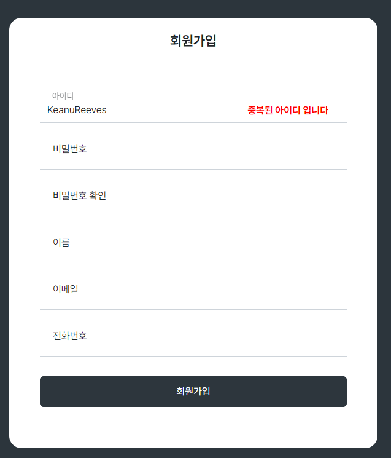
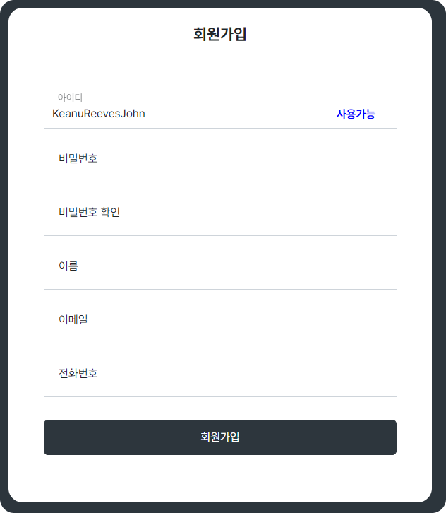
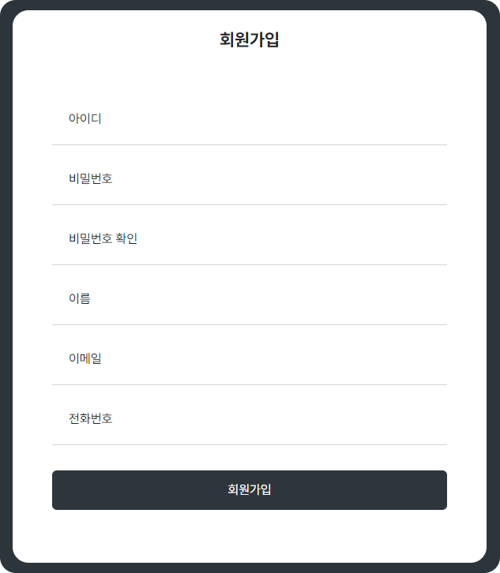
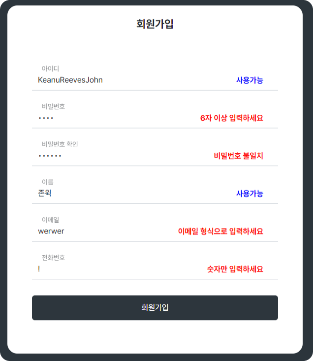
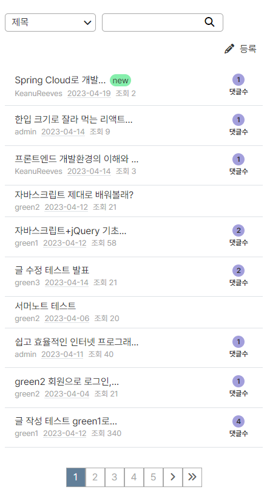

 
 

    

  

    
 Easy Speed Comportable 

    
 쉽고 빠르고 편하게 모두를 위한 교육 플랫폼  

 

<!-- ## 목차
- [프로젝트 소개](#프로젝트-소개)
- [제작 정보](#제작-정보)
- [주요 기능](#주요-기능)
- [특징](#특징)
- [사용 언어, 라이브러리, 툴](#사용-언어-라이브러리-툴)

  -->

## 프로젝트 소개
- LMS 온라인 강의 사이트 유저 페이지 제작 프로젝트 - 개인 프로젝트
- Landing Page, 로그인, 회원가입, 게시판, 회원정보 수정 및 탈퇴까지 구현된 사이트
- 현재로서는 커뮤니티 형태로 작동, 추후 About, Lecture 페이지 제작 및 추가 예정
- [🌎CLASS ESC 사이트](http://myst.dothome.co.kr/esc4/index.php)  
  [📃CLASS ESC 소개서](https://drive.google.com/file/d/1mp99E2JWwwNSro4y5pX0DxPwebs_o2r9/view?usp=sharing)
  
  <!-- [📃CLASS ESC 소개서](https://github.com/threehHong/CLASS_ESC_userPage/blob/main/CLASS%20ESC%20%EC%86%8C%EA%B0%9C%EC%84%9C.pdf) -->

 

## 제작 정보

#### 제작 형태
- 개인 프로젝트

#### 제작 기간 
- 23.03.20 ~ 23.04.13

<!-- 
- 3.20~3.29 기획, 디자인, 화면 구현(페이지)
- 3.30~4.10 기능 구현(메인, 로그인, 회원가입, 게시판 기능 구현)
- 4.11~4.13 기능 테스트 및 수정, PPT 준비
-->

#### 구현한 페이지
- 랜딩 페이지, 게시판,  로그인, 회원가입, 회원정보, 회원정보 수정, 회원탈퇴

 

## 주요 기능
#### 게시판
- 읽기(게시글 읽기)
- 쓰기(게시글 쓰기, 댓글 쓰기)
- 수정(게시글 수정
- 검색(제목, 작성자, 내용, 카테고리)
- 삭제(게시글 삭제)
- 페이지네이션
- 회원제 게시판(회원만 글 쓰기 가능)

#### 로그인
- 아이디 비밀번호 입력 후 로그인(틀릴 경우 불가)

#### 회원가입
- 각 항목 유효성 검사(실시간 표시+ 제출 후 표시)
- 아이디 검사(중복 여부 및 한글 영문 6자 이상 체크)
- 비밀번호 검사(6자이상 + 불일치 여부 체크)
- 이름 검사(한글 또는 영문 여부 체크)
- 이메일 형식 검사(이메일 형식 체크)
- 전화번호 검사(숫자 여부 체크) 

#### 회원정보
- 가입시 입력한 내역 확인

#### 회원정보 수정
- 비밀번호, 이름, 이메일, 전화번호 수정
- 각 항목 유효성 검사(실시간 표시+ 제출 후 표시)

#### 회원탈퇴
- 인증 과정 후 회원탈퇴
- 회원탈퇴 클릭 -> 빨간 색으로 표시된 문구(아이디/이름) 입력 -> 확인 버튼 활성화 -> 확인 버튼 클릭 -> 회원탈퇴 완료 

 

## 특징
#### 아이디 중복 검사 
- ajax를 활용한 아이디 중복검사

   &nbsp;
  

 

#### 유효성 검사 
- 회원 가입시 정규식을 활용한 유효성 검사

   &nbsp;
  

 

#### 반응형 웹사이트 
- 게시판 반응형 예시

   &nbsp;
  

 

## 사용 언어, 라이브러리, 툴
- html, css, js, jquery, ajax, php
- bootstrap, isotope, summernote
- Figma, Visual Studio Code, github

